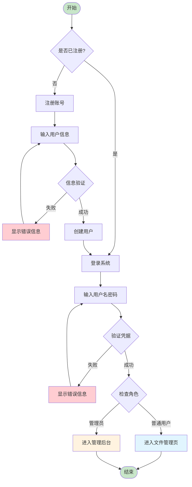
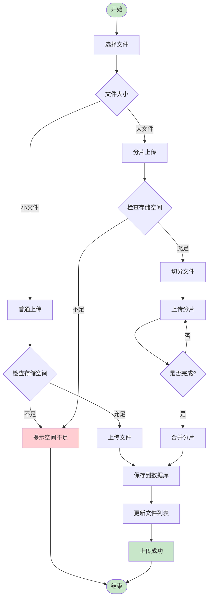
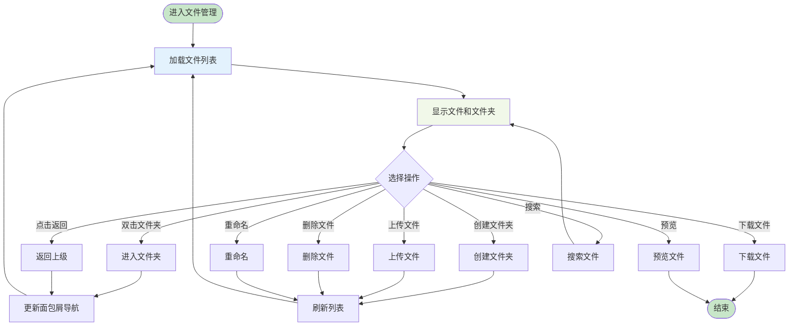
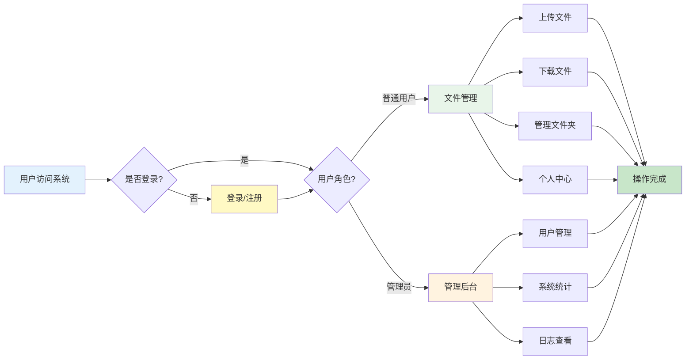

# CloudDriveLite 系统图表

## 1. 系统用例图

```mermaid
graph TB
    %% 参与者
    Guest[游客]
    User[普通用户]
    Admin[管理员]
    
    %% 系统边界
    subgraph System["CloudDriveLite 文件管理系统"]
        %% 认证模块
        UC1[注册账号]
        UC2[登录系统]
        UC3[找回密码]
        
        %% 文件管理
        UC4[上传文件]
        UC5[下载文件]
        UC6[删除文件]
        UC7[预览文件]
        UC8[搜索文件]
        
        %% 文件夹管理
        UC9[创建文件夹]
        UC10[浏览文件夹]
        
        %% 个人中心
        UC11[查看个人信息]
        UC12[查看存储空间]
        
        %% 管理员
        UC13[用户管理]
        UC14[查看统计]
        UC15[查看日志]
    end
    
    %% 游客用例
    Guest --> UC1
    Guest --> UC2
    Guest --> UC3
    
    %% 普通用户用例
    User --> UC2
    User --> UC4
    User --> UC5
    User --> UC6
    User --> UC7
    User --> UC8
    User --> UC9
    User --> UC10
    User --> UC11
    User --> UC12
    
    %% 管理员用例
    Admin --> UC2
    Admin --> UC4
    Admin --> UC5
    Admin --> UC6
    Admin --> UC13
    Admin --> UC14
    Admin --> UC15
    
    %% 样式
    classDef actor fill:#e3f2fd,stroke:#1976d2,stroke-width:2px
    classDef usecase fill:#f1f8e9,stroke:#558b2f,stroke-width:1px
    classDef system fill:#fff9c4,stroke:#f57f17,stroke-width:2px
    
    class Guest,User,Admin actor
    class UC1,UC2,UC3,UC4,UC5,UC6,UC7,UC8,UC9,UC10,UC11,UC12,UC13,UC14,UC15 usecase
```

## 2. 用户注册登录流程

## 3. 文件上传流程

## 4. 文件管理流程

## 5. 管理员管理流程

```mermaid
flowchart TD
    Start([管理员登录]) --> Dashboard[查看仪表盘]
    Dashboard --> Action{选择管理功能}
    
    Action -->|用户管理| UserManage[用户管理]
    Action -->|存储统计| StorageStat[存储统计]
    Action -->|登录日志| LoginLog[登录日志]
    
    UserManage --> UserAction{用户操作}
    UserAction -->|查看列表| ListUsers[显示用户列表]
    UserAction -->|搜索用户| SearchUser[搜索用户]
    UserAction -->|禁用/启用| ToggleUser[切换用户状态]
    UserAction -->|删除用户| DeleteUser[删除用户]
    
    ListUsers --> Refresh1[刷新列表]
    SearchUser --> Refresh1
    ToggleUser --> Refresh1
    DeleteUser --> Refresh1
    
    StorageStat --> ShowStat[显示统计数据]
    LoginLog --> ShowLog[显示登录记录]
    
    Refresh1 --> Dashboard
    ShowStat --> Dashboard
    ShowLog --> Dashboard
    
    Dashboard --> End([结束])
    
    style Start fill:#c8e6c9
    style End fill:#c8e6c9
    style Dashboard fill:#fff3e0
    style UserManage fill:#e1f5fe
```

## 6. 系统总体业务流程

## 图表说明

### 用例图
- **参与者**：游客、普通用户、管理员
- **用例**：系统的核心功能模块
- **关系**：展示不同角色可以执行的操作

### 流程图说明

1. **注册登录流程**：从访问系统到成功登录的完整流程
2. **文件上传流程**：区分普通上传和分片上传两种方式
3. **文件管理流程**：用户在文件管理页面的各种操作
4. **管理员管理流程**：管理员后台管理的核心流程
5. **系统总体流程**：系统整体的业务流转

所有图表都使用简洁的设计，重点展示核心业务流程，便于理解系统的运作方式。

